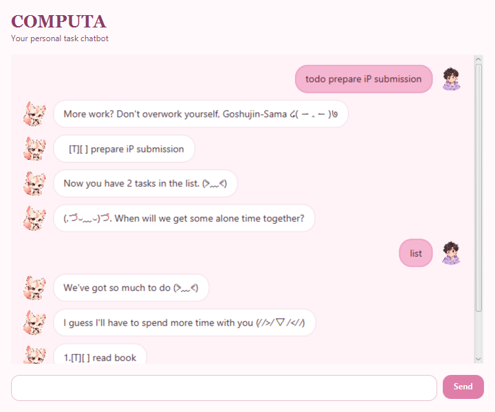

# Computa User Guide

Computa is a friendly desktop task chatbot for keeping track of things you need
to do. Enter commands in the box at the bottom of the window and press
<kbd>Enter</kbd> or **Send**. Your messages appear on the right; Computa's
replies appear on the left. Invalid commands are highlighted in red so they are
easy to spot.

## Quick start

1. Start Computa.
2. Add a task with `todo read the project brief`.
3. Type `list` to see all tasks.
4. Type `bye` when you are finished.

All commands ignore leading and trailing spaces. Task numbers shown by `list`
start at 1.

## Features

### Add a todo

Format: `todo DESCRIPTION`

Adds a task without a date or time.

Example: `todo borrow a library book`

### Add a deadline

Format: `deadline DESCRIPTION /by DATE_OR_TIME`

Adds a task that is due at the supplied date or time. Use `/by` once only.

Examples:

- `deadline submit report /by Friday`
- `deadline submit report /by 2026-09-18`
- `deadline submit report /by 2026-09-18 2359`

Structured dates use `yyyy-mm-dd`; Computa also accepts `d/M/yyyy`. Dates with
a time can use `HHmm`, `HH:mm`, or ISO date-time notation. Computa rejects
non-existent dates such as `2026-02-30`.

### Add an event

Format: `event DESCRIPTION /from START /to END`

Adds an event between a start and end date or time. Use each parameter once;
the end must be after the start when both values are structured dates/times.

Examples:

- `event team meeting /from Mon 2pm /to 4pm`
- `event project demo /from 2026-09-17 1400 /to 2026-09-17 1600`

### View and organize tasks

| Command | What it does | Example |
| --- | --- | --- |
| `list` | Shows every task and its number. | `list` |
| `find KEYWORD` | Shows tasks whose descriptions contain the keyword, ignoring case. | `find book` |
| `on DATE` | Shows deadlines and events on a structured date. | `on 2026-09-18` |
| `sort` | Orders dated tasks chronologically; undated todos appear last. | `sort` |

### Update tasks

| Command | What it does | Example |
| --- | --- | --- |
| `mark NUMBER` | Marks a task as done. | `mark 2` |
| `unmark NUMBER` | Marks a task as not done. | `unmark 2` |
| `delete NUMBER` | Removes a task. | `delete 2` |

Computa tells you if the task number is missing, not a number, or outside the
current list. Tasks are saved automatically in `data/computa.txt`; a missing
data folder or file is created at startup.

### Exit

Format: `bye`

Ends the current session and disables the command controls in the desktop
window.

## Troubleshooting

- If a command is highlighted in red, read the message and correct the command;
  your existing tasks are unchanged.
- If the task list looks empty after starting Computa, check that you launched
  it from the same folder as before; its `data` folder is relative to that
  folder.
- If the window is too narrow, resize it. Conversation bubbles reflow to fit
  the available space.
